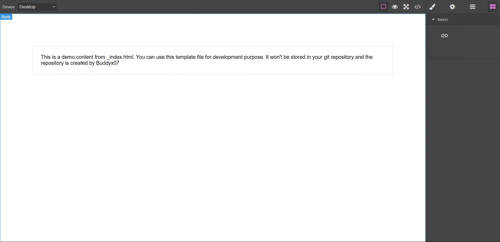

= GrapesJS URL Manager Plugin
:toc: macro
:icons: font
:source-highlighter: coderay
:sectnums:

https://github.com/Buddyx07/grapesjs-url-manager[grapesjs-url-manager]

A plugin for GrapesJS that simplifies hyperlink management by offering a customizable tab UI to configure URLs, emails, WhatsApp messages, and telephone links — with SPA support.

---

toc::[]

== ✨ Features

* ✅ Tab-based UI for different link types:
** URL
** Email
** WhatsApp
** Phone
* ✅ Inline SVG icons for each tab
* ✅ Real-time href generation
* ✅ Optional SPA navigation toggle
* ✅ "Open in new tab" trait
* ✅ Works with GrapesJS `<a>` (link) component

== 🔧 Requirements

* GrapesJS ^0.20.0+
* Modern browser (Chrome, Edge, Firefox)

== 🔌 Usage

[source, javascript]
----
import grapesjs from 'grapesjs';
import urlManagerComponent from './src/component.js';
import urlManagerTraits from './src/trait.js';

grapesjs.init({
  container: '#gjs',
  plugins: [urlManagerComponent, urlManagerTraits],
});
----

To preview the plugin with GrapesJS:

[source, bash]
----
npx grapesjs-cli serve
----

== 🧠 How It Works

When a link component is selected:

. A _smart tabbed panel_ appears in the trait manager.
. Choose between URL, Email, WhatsApp, or Phone.
. Input fields change based on the tab selected.
. SPA toggle appears only for URL.
. All link changes reflect live in the component.

== 🖼️ Screenshots

Url Block in Editor:

Tabbed interface with link type icons:

SPA routing toggle for internal links:

Final rendered HTML output:

Email Link Input Interface:

WhatsApp Massage Builder:

Phone Number Input:

== 📁 File Structure

[source, text]
----
grapesjs-url-manager/
├── src/
│   ├── component.js                ← Link component logic
│   └── trait.js                    ← Tabbed trait + SPA toggle
├── dist/
│   └── grapesjs-url-manager.min.js ← Optional bundle
├── index.html                     ← Demo file
├── package.json
├── README.adoc
└── LICENSE
----

== 🙌 Contributing

Pull requests are welcome.

Report issues or request features at:
https://github.com/Buddyx07/grapesjs-url-manager/issues

== 🧩 Future Plans

* Add link validation (email/URL format)
* Link preview popup
* Save frequently used presets
* Tooltip editor

== 👨‍💻 Author

Developed by https://github.com/Buddyx07[Buddyx07]
